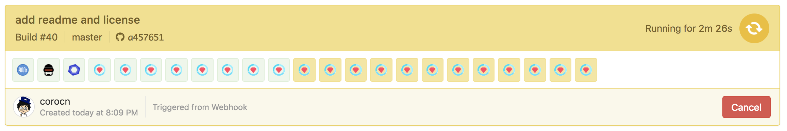
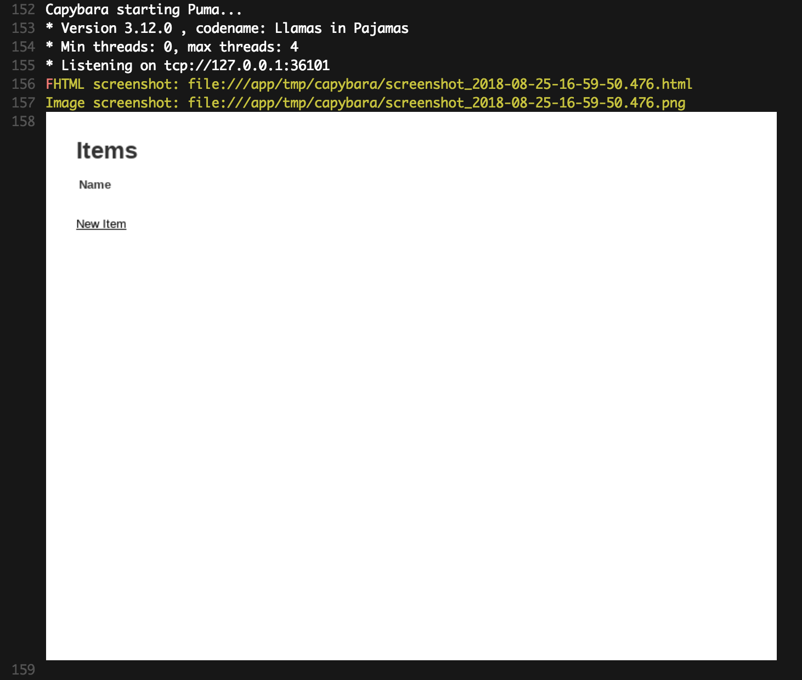

# Rails Buildkite Example

This is a parallel testing example with Rails and RSpec on [Buildkite](https://buildkite.com/).

Buildkite provides some simple examples.

 * https://github.com/buildkite/example-pipelines
 * https://github.com/buildkite/rails-docker-parallel-example

Those don't have e2e testings. This example has e2e testing using capybara on chromedriver and some lintings.
You can check screenshot on Buildkite's build log with capybara-inline-screenshot.

Enjoy Buildkite!

# Examples

 * Rspec
   * 20 parallels execution (E2E testing: 1, linting: 2, general rspec tests: 20)
   * Test splitting with [knapsack](https://github.com/ArturT/knapsack)
   * [capybara-inline-screenshot](https://github.com/buildkite/capybara-inline-screenshot)
 * Rubocop
 * ESlint
 
# Usage

 * Highly recommended to use [elastic-ci-stack-for-aws](https://github.com/buildkite/elastic-ci-stack-for-aws). Launch stack and build it manually.
 * You can try capybara-inline-screenshot with using a branch: https://github.com/corocn/rails-buildkite-example/tree/capybara-failed. E2E testing always failed in this branch, and screenshot will be uploaded.
  
# Screenshot

# Environments

 * Docker + Docker Compose
 * Ruby 2.5.1
 * Rails 5.2.1 + Webpacker + Vue
 * Node 8.x

# License

MIT
